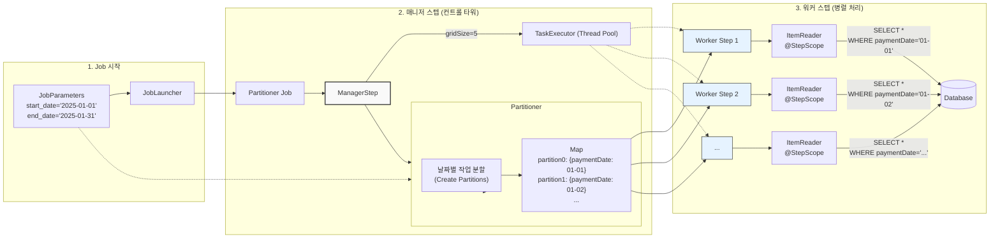

## Partitioner Flow

```mermaid
flowchart LR
    subgraph "1. Job 시작"
        direction LR
        JobParams["JobParameters<br/>start_date='2025-01-01'<br/>end_date='2025-01-31'"] --> JobLauncher;
    end

    subgraph "2. 매니저 스텝 (컨트롤 타워)"
        direction LR
        JobLauncher --> PartitionerJob["Partitioner Job"] --> ManagerStep;
        ManagerStep -- gridSize=5 --> TaskExecutor["TaskExecutor (Thread Pool)"];
        ManagerStep --> Partitioner;
        JobParams -.-> Partitioner;
    end

    subgraph "Partitioner"
        direction LR
        Partitioner --> PartitionerLogic["날짜별 작업 분할<br/>(Create Partitions)"];
        PartitionerLogic --> PartitionOutput["Map<String, ExecutionContext><br/>partition0: {paymentDate: 01-01}<br/>partition1: {paymentDate: 01-02}<br/>..."];
    end

    subgraph "3. 워커 스텝 (병렬 처리)"
        direction LR
        PartitionOutput --> WorkerContainer1["Worker Step 1"];
        PartitionOutput --> WorkerContainer2["Worker Step 2"];
        PartitionOutput --> WorkerContainerEtc["..."];

        WorkerContainer1 --> Reader1["ItemReader<br/>@StepScope"];
        WorkerContainer2 --> Reader2["ItemReader<br/>@StepScope"];
        WorkerContainerEtc --> ReaderEtc["ItemReader<br/>@StepScope"];
        Reader1 -- "SELECT *<br/>WHERE paymentDate='01-01'" --> Database[(Database)];
        Reader2 -- "SELECT *<br/>WHERE paymentDate='01-02'" --> Database[(Database)];
        ReaderEtc -- "SELECT *<br/>WHERE paymentDate='...'" --> Database[(Database)];
    end

    TaskExecutor -.-> WorkerContainer1 & WorkerContainer2 & WorkerContainerEtc;

%% Styling Section
    style ManagerStep fill:#f9f9f9,stroke:#333,stroke-width:2px;
    style WorkerContainer1 fill:#e6f3ff,stroke:#333;
    style WorkerContainer2 fill:#e6f3ff,stroke:#333;
    style WorkerContainerEtc fill:#e6f3ff,stroke:#333;
```