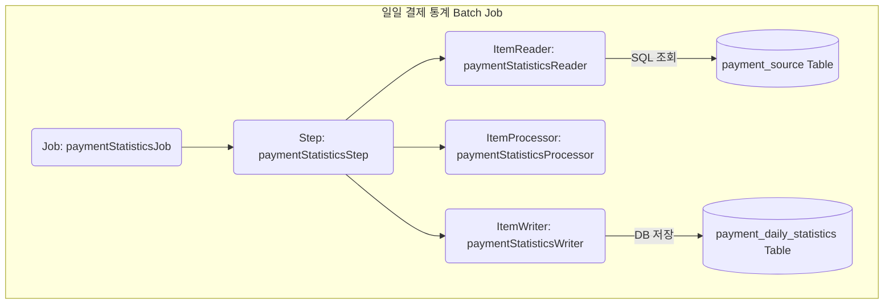

```mermaid
flowchart TD
    subgraph "일일 결제 통계 Batch Job"
        Job_PS("Job: paymentStatisticsJob") --> Step_PS("Step: paymentStatisticsStep");
        Step_PS --> Reader_PS("ItemReader: paymentStatisticsReader");
        Reader_PS -- SQL 조회 --> PaymentSourceDB[(payment_source Table)];
        Step_PS --> Processor_PS("ItemProcessor: paymentStatisticsProcessor");
        Step_PS --> Writer_PS("ItemWriter: paymentStatisticsWriter");
        Writer_PS -- DB 저장 --> PaymentDailyStatisticsDB[(payment_daily_statistics Table)];
    end
```