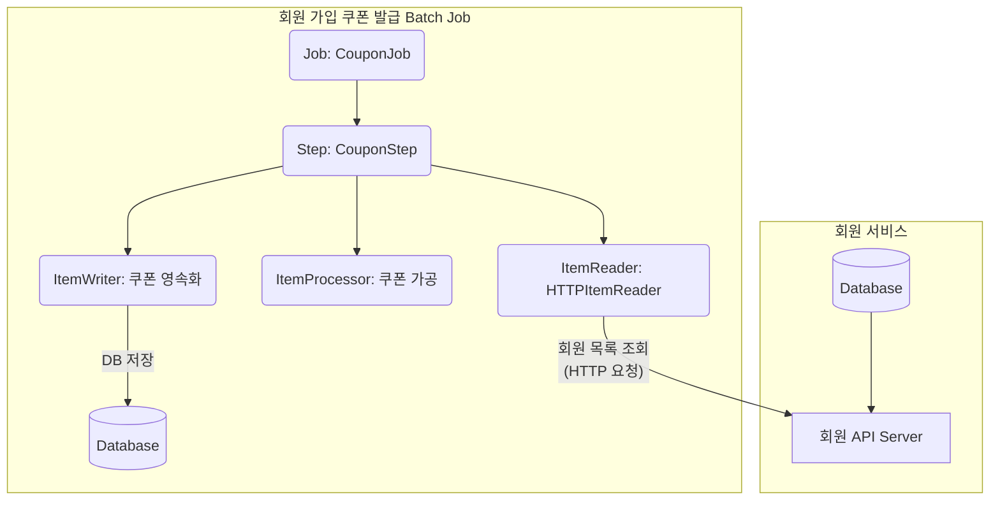

```mermaid
flowchart TD
    subgraph "회원 가입 쿠폰 발급 Batch Job"
        direction LR
        Job("Job: CouponJob") --> Step("Step: CouponStep");
        Step --> Reader("ItemReader: HTTPItemReader");
        Step --> Processor("ItemProcessor: 쿠폰 가공");
        Step --> Writer("ItemWriter: 쿠폰 영속화");
        Writer -- DB 저장 --> BatchDB[(Database)];
    end

    subgraph "회원 서비스"
        direction LR
        MemberServiceDB[(Database)] --> MemberAPIServer["회원 API Server"];
    end

    Reader -- "회원 목록 조회<br/>(HTTP 요청)" --> MemberAPIServer;
```